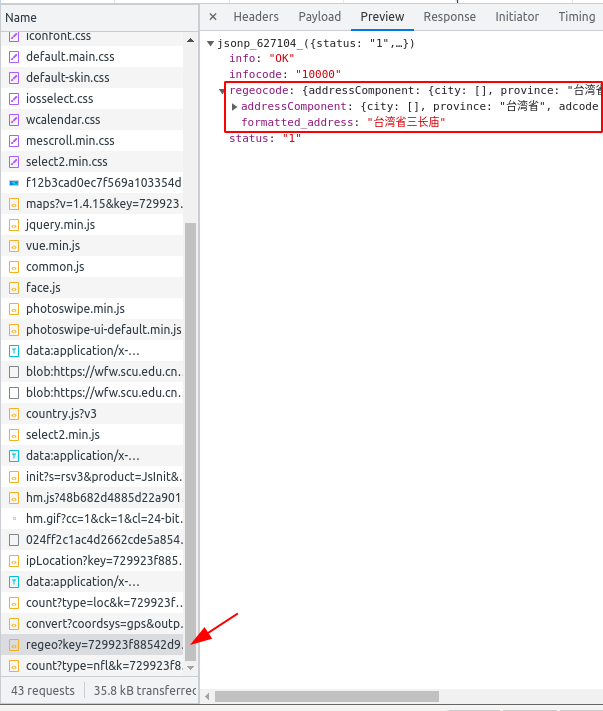

# **四川大学健康每日报打卡脚本**

> 不在校期间勿用 当前学校位置信息只有望江和江安

changlog
- 删除所需地址信息(v2模式 `people.json` 里面填写了也不处理 2022-12-21)
- 更改为服务器模式
- 添加江安校区
- 删除不必要的 import

打卡情况: new Vue 里面的 hasFlag

已打卡 `hasFlag: '1',`
未打卡 `hasFlag: '',`

`hasFlag: '(\d)',`

## 运行

1. 填写信息
2. 构建容器
3. 运行容器

### 填写信息

将信息填入 `resource/people.json`  填写方式参考模板`people_template.json`

> 详细见<https://github.com/koinin/scu-covid-auto-checkin/blob/master/README.md>

1. cookie 获取： <https://wfw.scu.edu.cn/ncov/wap/default/index> 登录后的index.html 的 cookie
   1. 登录后按F12
   2. 找到request header里面的 cookie 字段
   3. 得到 `UUkey` 和 `eai-sess` 的值
> 如图两个值 

2. 点击获取位置后的定位信息可以丰富位置模板

> 位置信息主要是 `regeo` 开头的文件里面
> 
> 这个地址不太正常 可以参照之前的地址看 一般是拿整个response或者里面regeocode这一块

### 构建容器

到仓库目录下

> docker 安装参考脚本<https://github.com/HUGHNew/dotfiles/blob/master/installer/install-docker.sh>

`sudo docker build -t checkin:latest .`

### 运行容器

docker 容器构建时不会将打卡的具体信息放进去 需要通过文件挂载的方式放入文件（即更改下面的路径）

docker run:`sudo docker run --name checkin -d -v /abs/path/to/your/res:/checkin/resource --restart=on-failure:10 checkin`

也可以使用 `bash -x engine.sh`

默认打卡时间为 0:30(CST) 支持自己提前手动打卡 打卡信息为上次提交的信息
